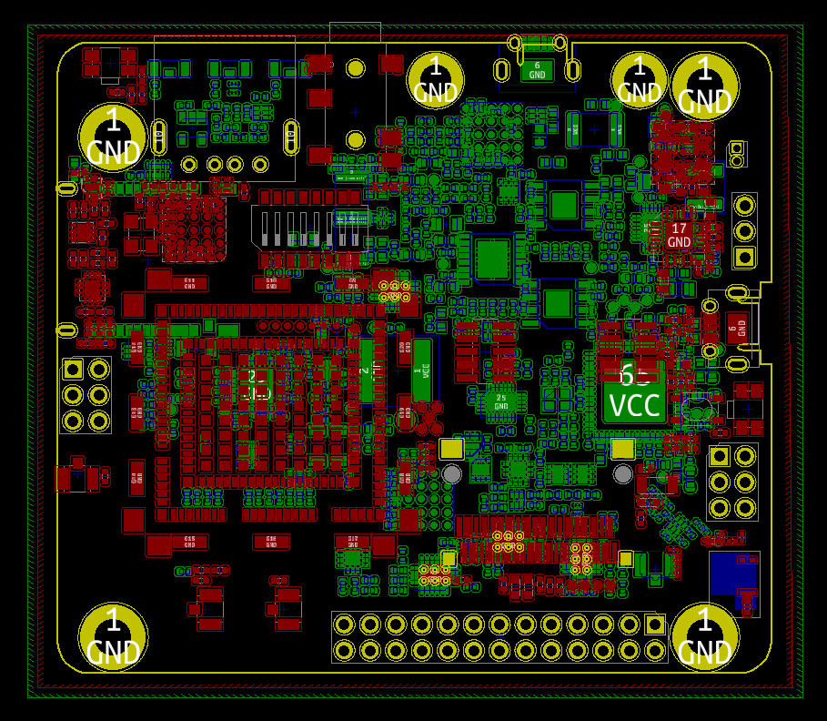
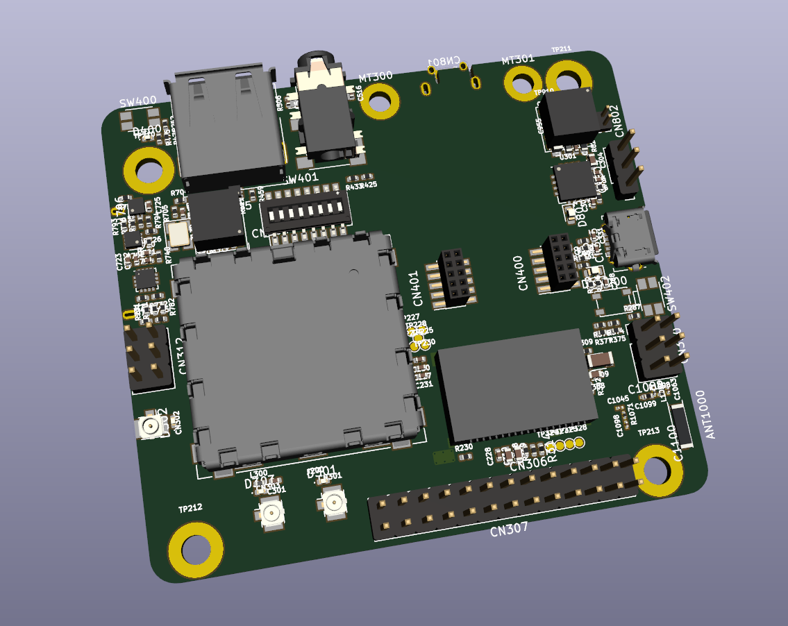

# MangOH Red

[MangOH Red](https://mangoh.io/mangoh-red-resources) board was build using Mentor DxDesigner for schematics and Pantheon PCB for layouts. This project aims to build a version using the GREAT [Kicad](http://kicad-pcb.org/) and [FreeCad](https://www.freecadweb.org/) with [StepUp](http://kicad-pcb.org/external-tools/stepup/) plugin for Kicad.

_This project is a work in progress._

Current status
- [x] [Schematics](https://github.com/leoheck/mangoh-red/blob/master/mangoh-red.pdf)
- [x] Footprint associations (100%)
- [ ] Fix some footprints (80%)
- [x] Footprint placement (100%)
- [x] 3D models associations (90%)
- [ ] Missing 3D models creation
- [x] PCB form factor
- [ ] Routing
- [x] Bill of materials
- [ ] GERBERS

Current board and 3d view

*Feel free to help me with a PR :)*

